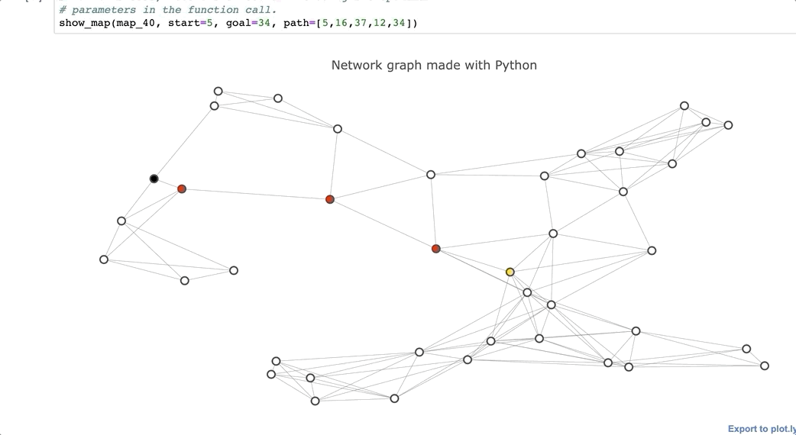

# Implementing-a-route-planner-algorithm
In this project I used a* algorithm to determine shortest path between 2 points 

full map is shown below:

Task for this project is to find shortest path from route 5 to route 34

For every 

Below shown is the shortest path from route 5 to route 34

